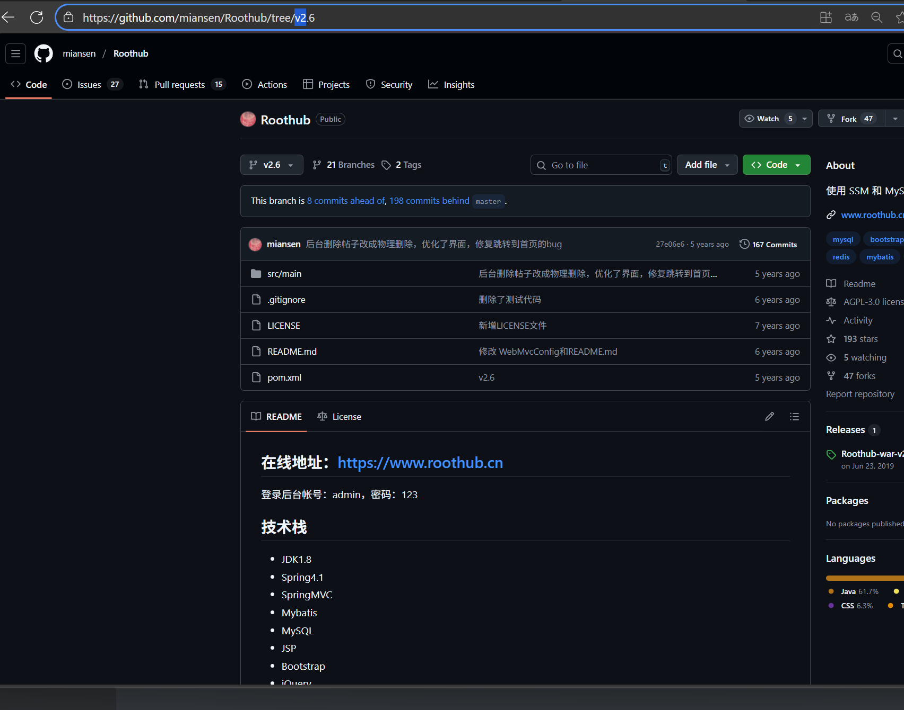
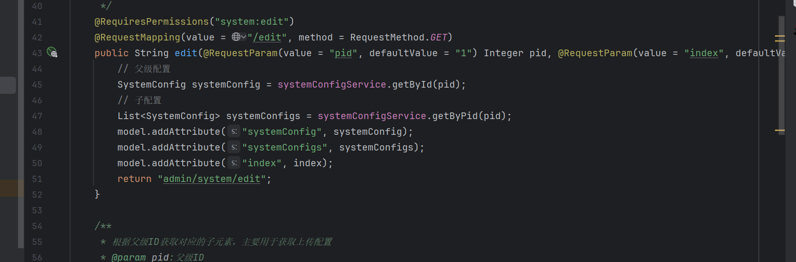
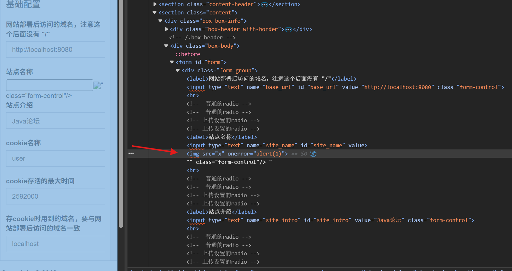
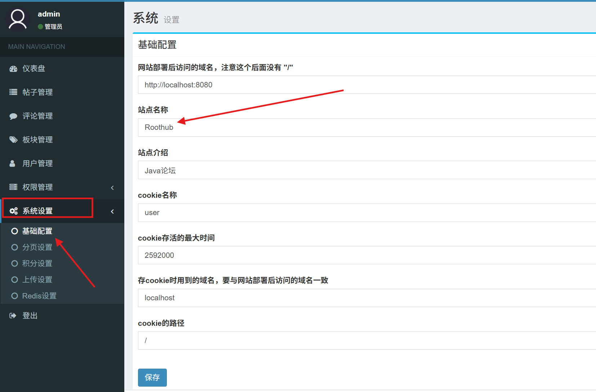
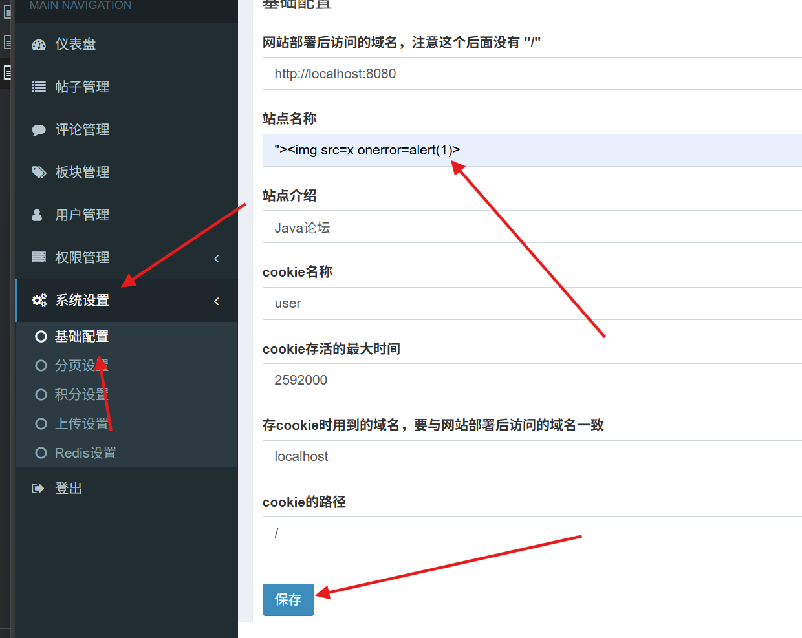
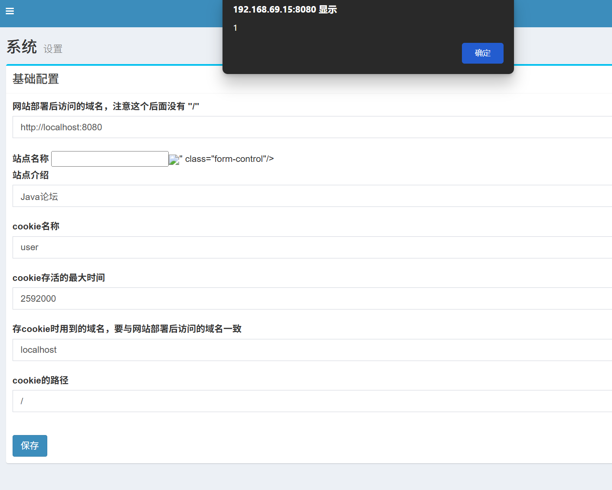

## Code audits

First, download the code to build the environment

User input is not filtered in the backend code

src/main/java/cn/roothub/web/admin/SystemConfigAdminController.java

The front-end is directly spliced into html

## Vulnerability reproducible

Then use IDEA to build the environment

After the environment is built, go to the background management and access the URL: http://192.168.69.15:8080/admin/system/edit

Then change the "Roothub" in "站点名称" to payload

The effect is obvious: there is a stored XSS here

