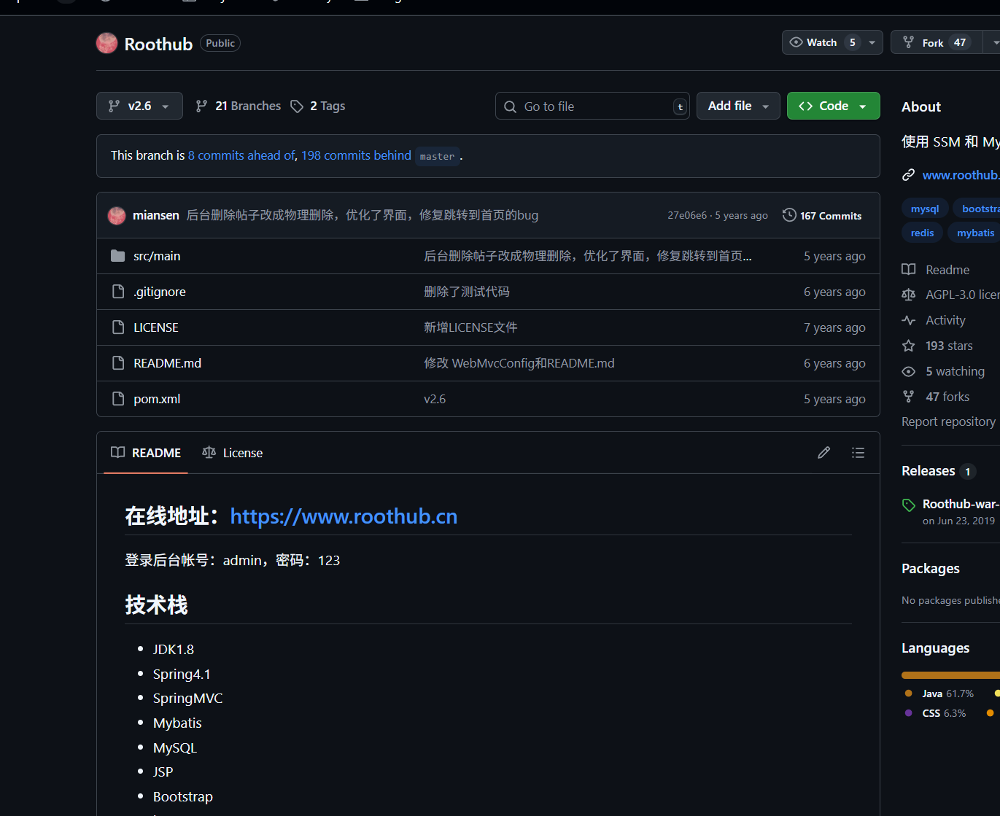
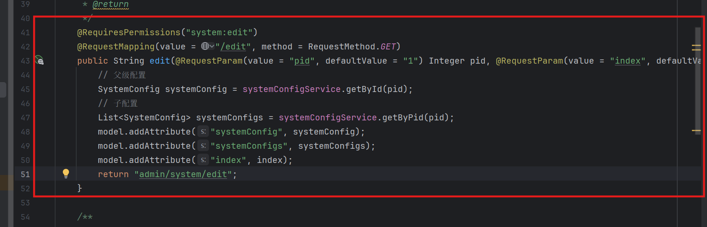
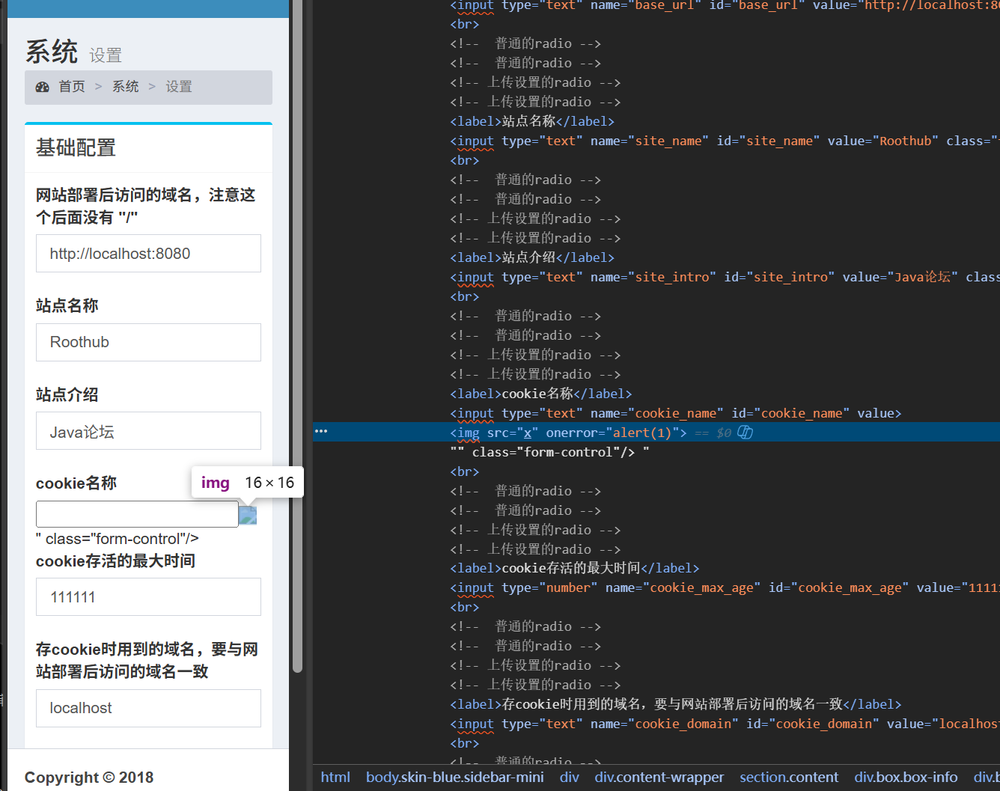
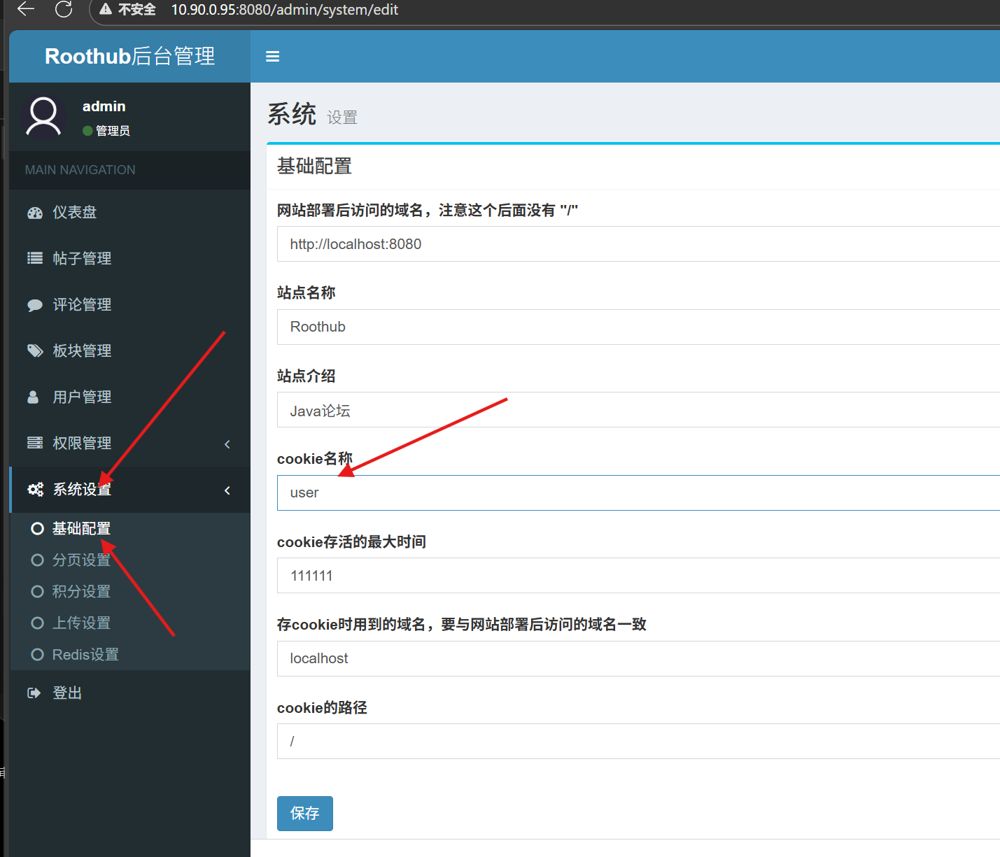
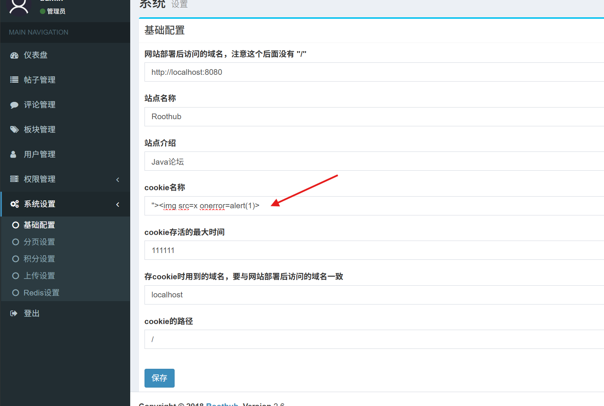

## Code audits

https://github.com/miansen/Roothub/tree/v2.6

Through the backend code, you can see that there is no filtering of user input

Front-end code

## Vulnerability reproducible

Next, use IDEA to build the environment, and then enter the background management

http://localhost:8080/admin/system/edit

Replace the content with a payload

Stored XSS exists here

