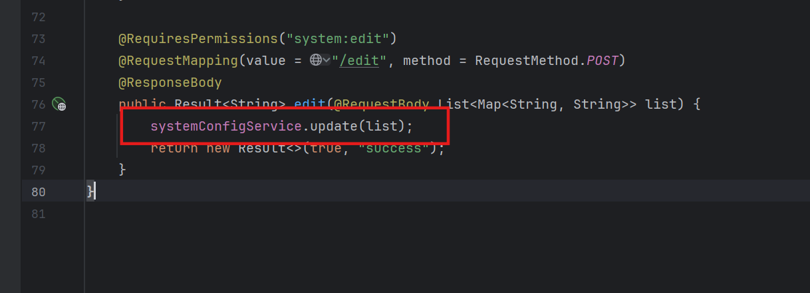

**First, let's set up the environment and download the branch of version 2.6**

**After building, log in to the background and follow the location in the picture**

**After saving, the XSS vulnerability will be triggered and a window will pop up**

**In the backend code, there is no filtering here**

src/main/java/cn/roothub/web/admin/SystemConfigAdminController.java

